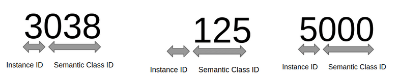

# COCO panoptic Labeling Guide

## Source 0

Theory behind editing coco panoptic mask values according to detectron2 repo: 

The encoding of the panoptic segmentation mask is as follows:
- The red channel encodes the lower bits of the instance ID.
- The green channel encodes the higher bits of the instance ID.
- The blue channel encodes the semantic label ID.

## Source 1 (detectron2)
For panoptic segmentation, the encoded segmentation map will be the raw bytes of an int32 panoptic map, where each pixel is assigned to a panoptic ID, which is computed by:

```
panoptic ID = semantic ID * label divisor + instance ID
```

where semantic ID will be:

- ignore label (0) for pixels not belonging to any segment
- for segments associated with iscrowd label:
    - (default): ignore label (0)
    - (if set --treat_crowd_as_ignore=false while running build_coco_data.py): category_id
- category_id for other segments

The instance ID will be 0 for pixels belonging to

- stuff class
- thing class with iscrowd label
- pixels with ignore label

and [1, label divisor] otherwise.

## Source 2

Register a "separated" version of COCO panoptic segmentation dataset named `name`.
The annotations in this registered dataset will contain both instance annotations and
semantic annotations, each with its own contiguous ids. Hence it's called "separated".

It follows the setting used by the PanopticFPN paper:

1. The instance annotations directly come from polygons in the COCO
    instances annotation task, rather than from the masks in the COCO panoptic annotations.

    The two format have small differences:
    Polygons in the instance annotations may have overlaps.
    The mask annotations are produced by labeling the overlapped polygons
    with depth ordering.

2. The semantic annotations are converted from panoptic annotations, where
    all "things" are assigned a semantic id of 0.
    All semantic categories will therefore have ids in contiguous
    range [1, #stuff_categories].


## Source 3

The following properties exist for panoptic segmentation.

Two Labels per Pixel: Panoptic segmentation assigns two labels to each of the pixels of an image – semantic label and instance ID. The pixels having the same label belong to the same semantic class and instance IDs differentiate its instances. 

Annotation File Per Image: As every pixel is labeled and assigned its pixel values, it is often saved as a separate (by convention, png) file with the pixel values, rather than a set of polygons or RLE encoding.

Non-Overlapping: Unlike instance segmentation, each pixel in panoptic segmentation has a unique label corresponding to the instance which means there are no overlapping instances.

While the input image has pixel values in the range 0-255 (grayscale range) the output panoptic segmentation image has a very different range of values. Each pixel value in the resultant panoptic segmentation file represents the class for that pixel.


len(model.CLASSES)

We find out we have 133 classes in total, representing various categories of objects.


Now let’s go to the panoptic segmentation output. If we get the unique values of the pixels in the panoptic segmentation, we get the following result:


To get the instance and class ids for each of these pixel values here’s how we interpret them:




The instance IDs separate different instances of the same class by a unique identifier. Note that instance IDs are global, i.e. they are not unique for each semantic class, rather the instance ID is a counter for the total instances in the image. In the case above since the highest instance ID is 5, we have 5 thing-instances in total, the rest is stuff. 

Mathematically We need to decode these pixel values to get the indices of the classes that they represent. Usually, panoptic segmentation encoding is such that: pixel value % (modulus operator) offset gives us the id of the class.


Because of our mathematical operation above, 2000 % 1000 = 5000 % 1000 = 0 . Thus, we see that pixel value 2000 is actually the same class as pixel value 5000. I.e. They both belong to class 0. Similarly, values 1038 and 3038, belong to the same class of 38.  

Correlating our class IDs to the model classes we get the following output. We see that 38 is for tennis_racket, and 0 is for person class, and similarly for other classes. thus answering our initial question of what pixel values correspond to what class in the panoptic segmentation label. 


## SOurce 4

Each pixel in our image have two values associated with it:

[“L”, “Z”] => ["Label", "Instance Number"]


As mentioned earlier there is a distinction created between stuff and things for segmentation tasks. This means that pixels that are contained in uncountable “stuff regions” (such as background or pavement), will have a Z index of None or an integer reflecting that categorization.

However in our example above, you can see that all the cats have their individual instance id’s, which enable us to identify them from one another.

Whereas a common png output would produce a 3 channels for a color image, this labeling and prediction format can be expressed as a two channel output, where channel 1 displays each pixel’s label and channel 2 displays each pixels instance.