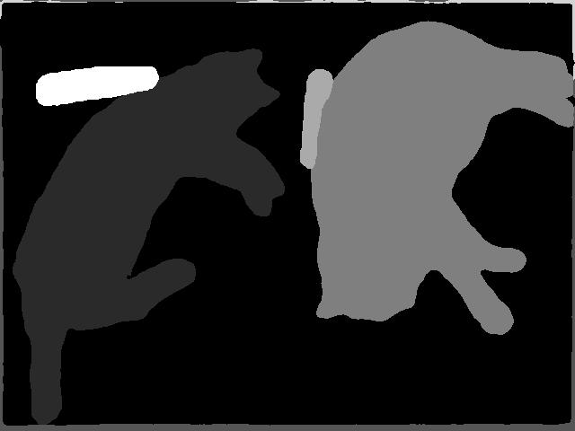

# Object Detection 🕵️‍♂️

Welcome to the object detection benchmarking repository! Here, we train and evaluate various transformers backbones for imagenet classification task using imagenet-1k and various transformers architectures for the panoptic segmentation task using the COCO dataset. To ensure ease of training and inference, we use the tiny versions of models and backbones.


<div style="display: flex;">
  
  
</div>

<br>


The later image is generated using this repo's code: [Check the Inference Command](./README.md#💡-inference-with-panoptic-segmentation-model)


## 📖 Table of Contents

Check this out!

- [Object Detection 🕵️‍♂️](#object-detection-🕵️‍♂️)
  - [📖 Table of Contents](#📖-table-of-contents)
    - [🛠️ Installation](#🛠️-installation)
    - [⚙️📥 Download all processed data at once from s3 bucket](#⚙️📥-download-all-processed-data-at-once-from-s3-bucket)
  - [💡 Backbones Training Pipelines](#💡-backbones-training-pipelines)
    - [📥 Downloading and Formatting the ImageNet Dataset](#📥-downloading-and-formatting-the-imagenet-dataset)
    - [🚀 Training and Finetuning Backbones with ImageNet-1k and Config Files](#🚀-training-and-finetuning-backbones-with-imagenet-1k-and-config-files)
    - [📊 Evaluate Backbones with ImageNet-1k validation data](#📊-evaluate-backbones-with-imagenet-1k-validation-data)
    - [💡 Inference with Backbones](#💡-inference-with-backbones)
  - [💡 Panoptic Segmentation Training Pipelines](#💡-panoptic-segmentation-training-pipelines)
    - [🔥 Supported Backbones for Panoptic Segmentation Architectures](#🔥-supported-backbones-for-panoptic-segmentation-architectures)
    - [📥 Downloading and Formatting the COCO dataset (2017)](#📥-downloading-and-formatting-the-coco-dataset-2017)
    - [🚀 Training and Finetuning different Panoptic Segmentation architecture models for any backbones](#🚀-training-and-finetuning-different-panoptic-segmentation-architecture-models-for-any-backbones)
    - [📊 Evaluate different Panoptic Segmentation architecture models with COCO Panoptic validation data](#📊-evaluate-different-panoptic-segmentation-architecture-models-with-coco-panoptic-validation-data)
    - [💡 Inference with Panoptic Segmentation Model](#💡-inference-with-panoptic-segmentation-model)
  - [📚 References & Citations](#📚-references--citations)


<br>

### 📝 To-Do

Check out our releases and refer to the [TO_DO.md](./TO_DO.md) file for the archived To-Do list.


### 🛠️ Installation

To set up and install the required dependencies, please follow the instructions in the [INSTALL.md](./INSTALL.md) file.

### ⚙️📥 Download all processed data at once from s3 bucket

If you want to download all our processed data at once without downloading imagenet and coco data manually, use this commands to download and extract all the formatted data:

```bash
mkdir formatted_data
cd formatted_data
wget https://object-detection-anchorblock.s3.ap-south-1.amazonaws.com/data/formatted_data.zip
unzip formatted_data.zip
rm -rf formatted_data.zip
cd ..
```


## 💡 Backbones Training Pipelines

This repository supports training the following backbones with the imagenet-1k dataset:

Backbones: 

```
- bit
- convnext
- convnextv2
- dinat
- focalnet
- nat
- resnet
- swin
```


### 📥 Downloading and Formatting the ImageNet Dataset

To use the ImageNet-1k dataset (2012), you need to manually download, extract, and organize it. Follow these steps:

1. Download the dataset:

```bash
bash data/imagenet_1k_download.sh
```

2. Extract the dataset:

```bash
bash data/imagenet_1k_extract.sh
```

For testing purposes, you can use the hosted dataset by executing the following Python code:

```python
import datasets

IMAGENET_DIR = "data/imagenet_1k"
ds = datasets.load_dataset("utils/imagenet_1k_dataset_script.py", data_dir=IMAGENET_DIR, splits = ["validation", "test"], cache_dir=".cache")
ds["validation"][0]
```

An example output:

```python
>>> ds["validation"][5678]
{'image': <PIL.JpegImagePlugin.JpegImageFile image mode=RGB size=500x375 at 0x7F15A02B0B50>, 'label': 118}
```

Now, convert all raw data to huggingface image classification data format and save to parquet for faster loading:

```bash
python scripts/raw_to_parquet_imagenet.py \
    --imagenet_dir="data/imagenet_1k" \
    --save_path="formatted_data/imagenet_1k"
```

<br>

### 🚀 Training and Finetuning Backbones with ImageNet-1k and Config Files

The default hyperparameters for training, as specified in the [FocalNet paper](https://arxiv.org/abs/2203.11926), are as follows:

```
| Parameter                      | Value     |
|-------------------------------|----------|
| Batch Size                    | 1024     |
| Base Learning Rate            | 1e-3     |
| Learning Rate Scheduler       | Cosine   |
| Minimum Learning Rate         | 1e-5     |
| Warm-up Epochs                | 20       |
| Training Epochs               | 300      |
| Finetuning Epochs             | 30       |
| Warm-up Schedule              | Linear   |
| Warm-up Learning Rate         | 1e-6     |
| Optimizer                     | AdamW    |
| Color Jitter Factor           | 0.4      |
| Auto-augmentation             | rand-m9-mstd0.5-inc1 |
| Random Erasing Probability    | 0.25     |
| Random Erasing Mode           | Pixel    |
| Mixup α                       | 0.8      |
| Cutmix α                      | 0.8      |
| Mixup Probability             | 1.0      |
| Mixup Switch Probability      | 0.5      |
| Stochastic Drop Path Rate     | 0.2      |
| Label Smoothing               | 0.1      |
| Gradient Clip                 | 5.0      |
| Weight Decay                  | 0.05     |
```

<br>


For training and finetuning, run:

```bash
export OMP_NUM_THREADS=4
export n_gpu=1
export model_type="focalnet"

torchrun --standalone --nproc_per_node=$n_gpu scripts/train_backbone_classifier.py \
    --model_type="resnet" \
    --config_path="configs/backbones/$model_type/config.json" \
    --processor_config_path="configs/backbones/$model_type/preprocessor_config.json" \
    --do_mixup_cutmix=true \
    --per_device_train_batch_size=1024 \
    --per_device_eval_batch_size=1024 \
    --gradient_accumulation_steps=1 \
    --learning_rate=1e-3 \
    --learning_rate_scheduler="cosine" \
    --minimum_learning_rate=1e-5 \
    --weight_decay=0.05 \
    --training_epochs=350 \
    --warmup_epochs=20 \
    --warmup_schedule="custom_cosine" \
    --warmup_learning_rate=1e-6 \
    --finetune_epochs=30 \
    --optimizer="adamw_torch" \
    --stochastic_drop_path_rate=0.2 \
    --gradient_clip=5.0 \
    --save_directory="outputs/backbone/$model_type" \
    --resume_from_checkpoint=None \
    --gradient_checkpointing=false \
    --fp16=true \
    --tf32=false
```


### 📊 Evaluate Backbones with ImageNet-1k validation data

These are the popular evaluation metrics used for ImageNet-1K:

```
- Top-1 Accuracy
- Top-5 Accuracy
- Precision
- Recall
- F1-Score
- Mean Average Precision (mAP)
```


Now, evaluate the model with imagenet validation data:

```bash
export model_type="focalnet"

python scripts/evaluate_backbone_classifier.py \
    --pretrained_model_name_or_path="outputs/backbone/$model_type" \
    --results_dir="outputs/backbone/$model_type"
```

You can also directly evaluate a huggingface's classifier model pretrained with imagenet:

```bash
python scripts/evaluate_backbone_classifier.py \
    --pretrained_model_name_or_path="microsoft/focalnet-tiny" \
    --results_dir="outputs"
```


### 💡 Inference with Backbones

An example inference code:

```python
from PIL import Image
import requests
from io import BytesIO
import matplotlib.pyplot as plt

from transformers import AutoImageProcessor, pipeline
from utils.augmentations import generate_transform_function

# picture of a baby golden retriver
IMG_URL = "https://t4.ftcdn.net/jpg/05/68/28/05/360_F_568280532_Bvxwd66M3Y22vVeJ3VRqHRAqrdNfJo7o.jpg" # change

pretrained_model_name_or_path = "microsoft/focalnet-tiny" # change

response = requests.get(IMG_URL)
image = Image.open(BytesIO(response.content))

classifier = pipeline("image-classification", model=pretrained_model_name_or_path)

classifier(image)

# output:
# [{'score': 0.9616713523864746, 'label': 'golden retriever'},
#  {'score': 0.004097872879356146, 'label': 'Labrador retriever'},
#  {'score': 0.001239714794792235, 'label': 'flat-coated retriever'},
#  {'score': 0.0010671772761270404, 'label': 'tennis ball'},
#  {'score': 0.0008922729175537825, 'label': 'kuvasz'}]
```


<br>

## 💡 Panoptic Segmentation Training Pipelines

This repository supports training the following architectures with the COCO dataset:

Architectures:

```
- DeTR
- mask2former
- maskformer
- custom_mask2former
- custom_maskformer
- oneformer
```

### 🔥 Supported Backbones for Panoptic Segmentation Architectures

💪 The following list represents the supported backbones for Panoptic Segmentation Architectures:
```
- `bit`
- `convnext`
- `convnextv2`
- `dinat`
- `focalnet`
- `nat`
- `resnet`
- `swin`
```

Please note the following important details about default huggingface object detection/ panoptic segmentation models:

- ⚠️ **maskformer, mask2former** (default, huggingface transformers) are currently only supporting swin-transformer as backbone (facebook). Any change in maskformer/mask2former backbone requires new architecture design.
- ✅ **oneformer** supports only above mentioned backbones/ classifiers.
- ✅ **DeTR** supports only above mentioned backbones/ classifiers.

So, to enable support for all types of pretrained backbones with **maskformer** and **mask2former**, this repository includes our customized model classes for both **maskformer** and **mask2former**. Check this out! 🎉

- 👉 [models/custom_maskformer.py](./models/custom_maskformer.py)
- 👉 [models/custom_mask2former.py](./models/custom_mask2former.py)


<br>

### 📥 Downloading and Formatting the COCO dataset (2017)


For using the COCO dataset (2017), you need to download and extract it manually first:

1. Download the dataset:

```bash
bash data/coco_datasets_download.sh
```

2. Extract the dataset:

```bash
bash data/coco_datasets_extract.sh
```

Expected dataset structure for COCO:

```
data/coco_datasets/
  annotations/
    instances_{train,val}2017.json
    panoptic_{train,val}2017.json
    caption_{train,val}2017.json
    # evaluate on instance labels derived from panoptic annotations
    panoptic2instances_val2017.json
  {train,val}2017/
    # image files that are mentioned in the corresponding json
  panoptic_{train,val}2017/  # png annotations
```

For testing purposes, you can use the hosted dataset by executing the following Python code:

```python
import datasets

COCO_DIR = "data/coco_datasets"

# bbox_mode = one of ["corners", "height_width"]
# data_variant = one of ["2017_detection", "2017_panoptic", "2017_detection_skip", "2017_panoptic_skip"]

bbox_mode = "corners"
data_variant = "2017_panoptic"

ds = datasets.load_dataset("utils/coco_dataset_script.py", data_variant, bbox_mode = bbox_mode, data_dir=COCO_DIR)
ds["train"][0]
```

An example output:

```python
>>> ds["train"][3]
{'image': <PIL.JpegImagePlugin.JpegImageFile image mode=RGB size=640x425 at 0x7F35BE2EA5B0>, 'image/filename': '000000000034.jpg', 'image/id': 34, 'panoptic_objects': [{'id': 5069153, 'area': 92893, 'bbox': [1, 20, 442, 399], 'is_crowd': False, 'category_id': 24, 'category_name': 'zebra', 'supercategory_id': 3, 'supercategory_name': 'animal', 'is_thing': True}, {'id': 2589299, 'area': 177587, 'bbox': [0, 0, 640, 425], 'is_crowd': False, 'category_id': 193, 'category_name': 'grass-merged', 'supercategory_id': 17, 'supercategory_name': 'plant', 'is_thing': False}], 'panoptic_image': <PIL.PngImagePlugin.PngImageFile image mode=RGB size=640x425 at 0x7F35BE2EA730>, 'panoptic_image/filename': '000000000034.png'}
```

Now, convert all raw data to huggingface object detection/ panoptic segmentation data format and save to parquet for faster loading. You can do for all variants: 

1. 2017_panoptic:

```bash
export data_variant="2017_panoptic"

python scripts/raw_to_parquet_coco.py \
    --coco_dir="data/coco_datasets" \
    --bbox_mode="corners" \
    --data_variant="$data_variant" \
    --save_path="formatted_data/coco_$data_variant"
```

2. 2017_panoptic_skip:

```bash
export data_variant="2017_panoptic_skip"

python scripts/raw_to_parquet_coco.py \
    --coco_dir="data/coco_datasets" \
    --bbox_mode="corners" \
    --data_variant="$data_variant" \
    --save_path="formatted_data/coco_$data_variant"
```

3. 2017_detection:

```bash
export data_variant="2017_detection"

python scripts/raw_to_parquet_coco.py \
    --coco_dir="data/coco_datasets" \
    --bbox_mode="corners" \
    --data_variant="$data_variant" \
    --save_path="formatted_data/coco_$data_variant"
```

4. 2017_detection_skip:

```bash
export data_variant="2017_detection_skip"

python scripts/raw_to_parquet_coco.py \
    --coco_dir="data/coco_datasets" \
    --bbox_mode="corners" \
    --data_variant="$data_variant" \
    --save_path="formatted_data/coco_$data_variant"
```

<br>


### 🚀 Training and Finetuning different Panoptic Segmentation architecture models for any backbones

🚧 Training different models for different backbones will be added in future release. Stay tuned!

<br>


### 📊 Evaluate different Panoptic Segmentation architecture models with COCO Panoptic validation data


🚧 Evaluation module for panoptic segmentation will be added in future release. Stay tuned!

<br>


### 💡 Inference with Panoptic Segmentation Model

An example inference code:

```python
import sys
sys.path.append('./')

from transformers import AutoImageProcessor
from PIL import Image, ImageDraw
import numpy as np
import requests
import torch
from models import AutoModelForPanopticSegmentation


# load MaskFormer fine-tuned on COCO panoptic segmentation
feature_extractor = AutoImageProcessor.from_pretrained("facebook/maskformer-swin-tiny-coco")
model = AutoModelForPanopticSegmentation.from_pretrained("facebook/maskformer-swin-tiny-coco")

url = "http://images.cocodataset.org/val2017/000000039769.jpg"
image = Image.open(requests.get(url, stream=True).raw)
inputs = feature_extractor(images=image, return_tensors="pt")

outputs = model(**inputs)

# you can pass them to feature_extractor for postprocessing
result = feature_extractor.post_process_panoptic_segmentation(outputs, target_sizes=[image.size[::-1]])[0]
# we refer to the demo notebooks for visualization (see "Resources" section in the MaskFormer docs)


predicted_panoptic_map = result["segmentation"]

# Get segments_info
segments_info = result['segments_info']


# Convert the tensor to numpy
image_array = predicted_panoptic_map.numpy()

# Normalize the array to the range 0-255
normalized_array = (image_array - np.min(image_array)) * (255 / (np.max(image_array) - np.min(image_array)))

# Convert the array to uint8 data type
uint8_array = normalized_array.astype(np.uint8)

# Create a PIL image from the uint8 array
image = Image.fromarray(uint8_array)

# Load the labels dictionary from the model configuration (model.config.id2label)
id2label = model.config.id2label


# Create a PIL draw object
draw = ImageDraw.Draw(image)

# Iterate over the segments_info dictionary
for segment in segments_info:
    segment_id = segment['id']
    label_id = segment['label_id']
    label = id2label[label_id]
    if label > 79:
        continue
    score = segment['score']
    
    # Get the bounding box coordinates for the segment
    bbox = np.argwhere(image_array == segment_id)
    ymin, xmin = np.min(bbox, axis=0)
    ymax, xmax = np.max(bbox, axis=0)
    
    # Draw the bounding box rectangle
    draw.rectangle([(xmin, ymin), (xmax, ymax)], outline='white')
    
    # Add label text
    text = f"{label} ({score:.2f})"
    draw.text((xmin, ymin - 12), text, fill='white')


# Save the image
image.save('predicted_panoptic_map.png')
```


## 📚 References & Citations

**ImageNet Datasets:**

```
@article{imagenet15russakovsky,
    Author = {Olga Russakovsky and Jia Deng and Hao Su and Jonathan Krause and Sanjeev Satheesh and Sean Ma and Zhiheng Huang and Andrej Karpathy and Aditya Khosla and Michael Bernstein and Alexander C. Berg and Li Fei-Fei},
    Title = { {ImageNet Large Scale Visual Recognition Challenge} },
    Year = {2015},
    journal   = {International Journal of Computer Vision (IJCV)},
    doi = {10.1007/s11263-015-0816-y},
    volume={115},
    number={3},
    pages={211-252}
}
```

**COCO Datatsets:**

```
@article{DBLP:journals/corr/LinMBHPRDZ14,
  author    = {Tsung{-}Yi Lin and
               Michael Maire and
               Serge J. Belongie and
               Lubomir D. Bourdev and
               Ross B. Girshick and
               James Hays and
               Pietro Perona and
               Deva Ramanan and
               Piotr Doll{'{a} }r and
               C. Lawrence Zitnick},
  title     = {Microsoft {COCO:} Common Objects in Context},
  journal   = {CoRR},
  volume    = {abs/1405.0312},
  year      = {2014},
  url       = {http://arxiv.org/abs/1405.0312},
  archivePrefix = {arXiv},
  eprint    = {1405.0312},
  timestamp = {Mon, 13 Aug 2018 16:48:13 +0200},
  biburl    = {https://dblp.org/rec/bib/journals/corr/LinMBHPRDZ14},
  bibsource = {dblp computer science bibliography, https://dblp.org}
}
```


**Natten** for Neighborhood Attention and Dilated Neighborhood Attention

Link: [github link](https://github.com/SHI-Labs/NATTEN)

```
@inproceedings{hassani2023neighborhood,
	title        = {Neighborhood Attention Transformer},
	author       = {Ali Hassani and Steven Walton and Jiachen Li and Shen Li and Humphrey Shi},
	year         = 2023,
        booktitle    = {IEEE/CVF Conference on Computer Vision and Pattern Recognition (CVPR)}
}
@article{hassani2022dilated,
	title        = {Dilated Neighborhood Attention Transformer},
	author       = {Ali Hassani and Humphrey Shi},
	year         = 2022,
	url          = {https://arxiv.org/abs/2209.15001},
	eprint       = {2209.15001},
	archiveprefix = {arXiv},
	primaryclass = {cs.CV}
}
```