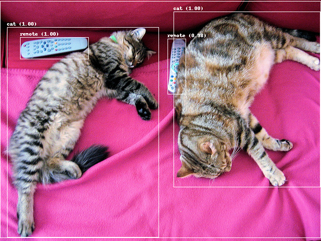
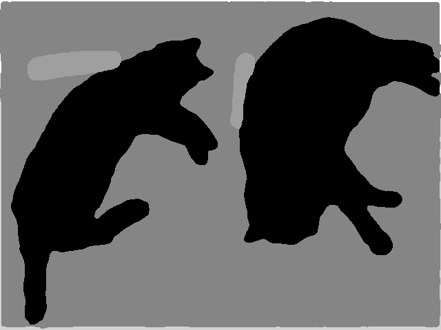
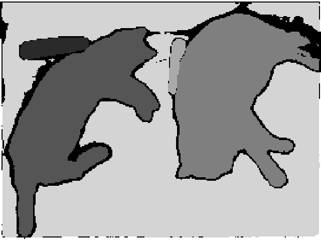
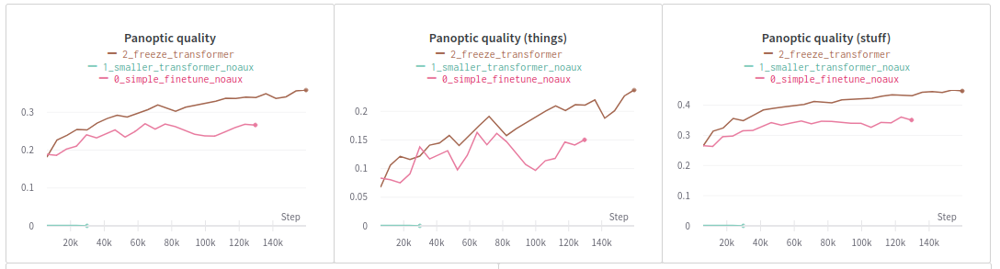

# Object Detection

<p align="center">
  <a href="https://ubuntu.com/">
    
  </a>
  <a href="https://www.python.org/">
    
  </a>
  <a href="https://pytorch.org/">
    
  </a>
  <a href="https://huggingface.co/transformers/">
    
  </a>
  <a href="https://huggingface.co/datasets/">
    
  </a>
  <a href="https://huggingface.co/docs/accelerate/">
    
  </a>
  <a href="https://github.com/rwightman/pytorch-image-models">
    
  </a>
</p>

Welcome to the object detection benchmarking repository! Here, we train and evaluate various transformers backbones for imagenet classification task using imagenet-1k and various transformers architectures for the panoptic segmentation task using the COCO dataset. To ensure ease of training and inference, we use the tiny versions of models and backbones. 


| Input                           | Outputs                |                            | 
| ------------------------------- | ---------------------- | -------------------------- | 
| Original Image                  | Bounding Box Detection | Semantic Segmentation      | 
|  |  |  | 
|                  | Panoptic Segmentation  | Instance Segmentation         |
| |    |   |


<br>

The later images are generated using this repo's code: [Check the Inference Command](./README.md#inference-with-panoptic-segmentation-model)

[Check the pdf](./object_detection.pdf) about learn more about object detection benchmarking.

## Table of Contents

Check this out!

- [Object Detection 🕵️‍♂️](#object-detection)
  - [📖 Table of Contents](#table-of-contents)
    - [🛠️ Installation](#installation)
  - [💡 Backbones Training Pipelines](#backbones-training-pipelines)
    - [🚀 Training and Finetuning Backbones with ImageNet-1k and Config Files](#training-and-finetuning-backbones-with-imagenet-1k-and-config-files)
    - [📊 Evaluate Backbones with ImageNet-1k validation data](#evaluate-backbones-with-imagenet-1k-validation-data)
    - [💡 Inference with Backbones](#inference-with-backbones)
  - [💡 Panoptic Segmentation Training Pipelines](#panoptic-segmentation-training-pipelines)
    - [🔥 Supported Backbones for Panoptic Segmentation Architectures](#supported-backbones-for-panoptic-segmentation-architectures)
    - [🚀 Training and Finetuning different Panoptic Segmentation architecture models for any backbones](#training-and-finetuning-different-panoptic-segmentation-architecture-models-for-any-backbones)
    - [📊 Evaluate different Panoptic Segmentation architecture models with COCO Panoptic validation data](#evaluate-different-panoptic-segmentation-architecture-models-with-coco-panoptic-validation-data)
    - [💡 Inference with Panoptic Segmentation Model](#inference-with-panoptic-segmentation-model)
      - [Inferenece 1: Bounding Box Detection](#inferenece-1-bounding-box-detection)
      - [Inferenece 2: Panoptic Segmentation](#inferenece-2-panoptic-segmentation)
      - [Inferenece 3: Instance Segmentation](#inferenece-3-instance-segmentation)
      - [Inferenece 4: Semantic Segmentation](#inferenece-4-semantic-segmentation)
  - [Benchmarking (Current Trends)](#benchmarking-current-trends)
  - [📚 References & Citations](#references--citations)


<br>

### To-Do

Check out our releases and refer to the [TO_DO.md](./TO_DO.md) file for the archived To-Do list.


### Installation

To set up and install the required dependencies, please follow the instructions in the [INSTALL.md](./INSTALL.md) file.


## Backbones Training Pipelines

This repository supports training the following backbones with the imagenet-1k dataset:

Backbones: 


- [BiT](https://arxiv.org/abs/1912.11370)
- [ConvNeXt](https://arxiv.org/abs/2201.03545)
- [ConvNeXt V2](https://arxiv.org/abs/2301.00808)
- [DiNAT](https://arxiv.org/abs/2209.15001)
- [FocalNet](https://arxiv.org/abs/2203.11926)
- [NAT](https://arxiv.org/abs/2204.07143)
- [ResNet](https://arxiv.org/abs/1512.03385)
- [Swin Transformer](https://arxiv.org/abs/2103.14030)


For download and preprocess ImageNet-1k, please follow [this instruction link.](./docs/Vision_Data_Guide.md#downloading-and-formatting-the-imagenet-dataset)

<br>

### Training and Finetuning Backbones with ImageNet-1k and Config Files

The default hyperparameters for training, as specified in the [FocalNet paper](https://arxiv.org/abs/2203.11926), are as follows:

```
| Parameter                     | Value                |
|-------------------------------|----------------------|
| Batch Size                    | 1024                 |
| Base Learning Rate            | 1e-3                 |
| Learning Rate Scheduler       | Cosine               |
| Minimum Learning Rate         | 1e-5                 |
| Warm-up Epochs                | 20                   |
| Training Epochs               | 300                  |
| Finetuning Epochs             | 30                   |
| Warm-up Schedule              | Linear               |
| Warm-up Learning Rate         | 1e-6                 |
| Optimizer                     | AdamW                |
| Color Jitter Factor           | 0.4                  |
| Auto-augmentation             | rand-m9-mstd0.5-inc1 |
| Random Erasing Probability    | 0.25                 |
| Random Erasing Mode           | Pixel                |
| Mixup α                       | 0.8                  |
| Cutmix α                      | 0.8                  |
| Mixup Probability             | 1.0                  |
| Mixup Switch Probability      | 0.5                  |
| Stochastic Drop Path Rate     | 0.2                  |
| Label Smoothing               | 0.1                  |
| Gradient Clip                 | 5.0                  |
| Weight Decay                  | 0.05                 |
```

<br>


For training and finetuning, run:

```bash
export OMP_NUM_THREADS=4
export n_gpu=1
export model_type="focalnet"

torchrun --standalone --nproc_per_node=$n_gpu scripts/training_scripts/train_backbone_classifier.py \
    --pretrained_model_name_or_path="./models/backbones/focalnet" \
    --do_mixup_cutmix=true \
    --per_device_train_batch_size=1024 \
    --per_device_eval_batch_size=1024 \
    --gradient_accumulation_steps=1 \
    --learning_rate=1e-3 \
    --learning_rate_scheduler="cosine" \
    --minimum_learning_rate=1e-5 \
    --weight_decay=0.05 \
    --training_epochs=350 \
    --warmup_epochs=20 \
    --warmup_schedule="custom_cosine" \
    --warmup_learning_rate=1e-6 \
    --finetune_epochs=30 \
    --optimizer="adamw_torch" \
    --stochastic_drop_path_rate=0.2 \
    --gradient_clip=5.0 \
    --save_directory="outputs/backbone/$model_type" \
    --resume_from_checkpoint=None \
    --gradient_checkpointing=false \
    --fp16=true \
    --tf32=false
```


### Evaluate Backbones with ImageNet-1k validation data

These are the popular evaluation metrics used for ImageNet-1K:


- [Top-1 Accuracy](## "Top-1 accuracy is the conventional accuracy, which means that the model answer (the one with the highest probability) must be exactly the expected answer.")
- [Top-5 Accuracy](## "Top-5 accuracy means that any of your model that gives 5 highest probability answers that must match the expected answer.")
- [Precision](## "Precision is the ratio of correctly classified positive samples (True Positive) to a total number of classified positive samples (either correctly or incorrectly).")
- [Recall](## "Recall is the ratio between the numbers of Positive samples correctly classified as Positive to the total number of Positive samples.")
- [F1-Score](## "F1-Score is the harmonic mean of Precision and Recall.")
- [Mean Average Precision (mAP)](## "The mean average precision or MAP score is calculated by taking the mean AP over all classes and/or overall IoU thresholds, depending on different detection challenges that exist.")


Now, evaluate the model with imagenet validation data:

```bash
export model_type="focalnet"

python scripts/evaluation_scripts/evaluate_backbone_classifier.py \
    --pretrained_model_name_or_path="outputs/backbone/$model_type" \
    --results_dir="outputs/backbone/$model_type"
```

You can also directly evaluate a huggingface's classifier model pretrained with imagenet:

```bash
python scripts/evaluation_scripts/evaluate_backbone_classifier.py \
    --pretrained_model_name_or_path="microsoft/focalnet-tiny" \
    --results_dir="outputs"
```


### Inference with Backbones
Follow this [notebook](./notebooks/inference/backbone_classification.ipynb).


<br>

## Panoptic Segmentation Training Pipelines

This repository supports training the following architectures with the COCO dataset:

Architectures:


- [DeTR](./models/detr.py)
- [mask2former](./models/mask2former.py)
- [maskformer](./models/maskformer.py)
- [custom_mask2former](./models/custom_mask2former.py)
- [custom_maskformer](./models/custom_maskformer.py)
- [oneformer](./models/oneformer.py)


### Supported Backbones for Panoptic Segmentation Architectures

💪 The following list represents the supported backbones for Panoptic Segmentation Architectures:

- [bit](./models/backbones/bit/)
- [convnext](./models/backbones/convnext/)
- [convnextv2](./models/backbones/convnextv2/)
- [dinat](./models/backbones/dinat/)
- [focalnet](./models/backbones/focalnet/)
- [nat](./models/backbones/nat/)
- [resnet](./models/backbones/resnet/)
- [swin](./models/backbones/swin/)


Please note the following important details about default huggingface object detection/ panoptic segmentation models:

- ⚠️ **maskformer, mask2former** (default, huggingface transformers) are currently only supporting swin-transformer as backbone (facebook). Any change in maskformer/mask2former backbone requires new architecture design.
- ✅ **oneformer** supports only above mentioned backbones/ classifiers.
- ✅ **DeTR** supports only above mentioned backbones/ classifiers.

So, to enable support for all types of pretrained backbones with **maskformer** and **mask2former**, this repository includes our customized model classes for both **maskformer** and **mask2former**. Check this out! 🎉

- 👉 [models/custom_maskformer.py](./models/custom_maskformer.py)
- 👉 [models/custom_mask2former.py](./models/custom_mask2former.py)


<br>

For download and preprocess COCO dataset (2017), please follow this instructions link:

 - [COCO object detection data download and preprocess](./docs/Vision_Data_Guide.md#coco-object-detection-data)
 - [COCO panoptic segmentation data download and preprocess](./docs/Vision_Data_Guide.md#coco-panoptic-segmentation-data)
 - [COCO instance segmentation data download and preprocess](./docs/Vision_Data_Guide.md#coco-instance-segmentation-data)


<br>


### Training and Finetuning different Panoptic Segmentation architecture models for any backbones

Backbone must be freezed during training after loaded with pretrained backbone weights for better results.



🚧 Training different models for different backbones will be added in future release. Stay tuned!

<br>


### Evaluate different Panoptic Segmentation architecture models with COCO Panoptic validation data


🚧 Evaluation module for panoptic segmentation will be added in future release. Stay tuned!

<br>


### Inference with Panoptic Segmentation Model

You can infer as four types of vision tasks!
1. [Bounding Box Detection](./notebooks/inference/bbox_detection.ipynb)
2. [Panoptic Segmentation](./notebooks/inference/panoptic_segmentation.ipynb)
3. [Instance Segmentation](./notebooks/inference/instance_segmentation.ipynb)
4. [Semantic Segmentation](./notebooks/inference/semantic_segmentation.ipynb)


## Benchmarking (Current Trends)

Explore popular backbone models and benchmarking models and datasets here for object detection, semantic segmentation, instance segmentation, and panoptic segmentation in computer vision. 

**Popular Backbone Model Comparison:**

- [ResNet](https://arxiv.org/abs/1512.03385)
- [ViT](https://arxiv.org/abs/2010.11929)
- [Swin Transformer](https://arxiv.org/abs/2103.14030)
- [FocalNet](https://arxiv.org/abs/2203.11926)
<!-- - new_MODEL -->

All models mentioned above are available in three different sizes:

- Tiny
- Small
- Base

**Popular Training Tasks and Datasets**

- Pretraining ([Imagenet22k](https://www.image-net.org/index.php))
- Classification ([Imagenet 1k](https://www.image-net.org/download.php))
- Object Detection ([COCO](https://cocodataset.org/#home))
- Instance Segmentation ([COCO](https://cocodataset.org/#home))
- Panoptic Segmentation ([COCO](https://cocodataset.org/#home))
- Semantic Segmentation ([ADE20K](https://groups.csail.mit.edu/vision/datasets/ADE20K/))

**Popular Object Detection Models for Benchmarking**

- [Mask-RCNN-1x](https://github.com/facebookresearch/maskrcnn-benchmark)
- [Mask-RCNN-3x](https://github.com/facebookresearch/maskrcnn-benchmark)

**Popular Semantic Segmentation Models for Benchmarking**

- [UperNet](https://arxiv.org/abs/1807.10221)
- [SegFormer](https://arxiv.org/abs/2105.15203)
- [Mask2Former](https://github.com/facebookresearch/Mask2Former)

**Popular Instance Segmentation Models for Benchmarking**

- [DeTR](https://github.com/facebookresearch/detr)
- [Mask2Former](https://github.com/facebookresearch/Mask2Former)

**Popular Panoptic Segmentation Models for Benchmarking**

- [DeTR](https://github.com/facebookresearch/detr)
- [Mask2Former](https://github.com/facebookresearch/Mask2Former)


## References & Citations

**ImageNet Datasets:**

```
@article{imagenet15russakovsky,
    Author = {Olga Russakovsky and Jia Deng and Hao Su and Jonathan Krause and Sanjeev Satheesh and Sean Ma and Zhiheng Huang and Andrej Karpathy and Aditya Khosla and Michael Bernstein and Alexander C. Berg and Li Fei-Fei},
    Title = { {ImageNet Large Scale Visual Recognition Challenge} },
    Year = {2015},
    journal   = {International Journal of Computer Vision (IJCV)},
    doi = {10.1007/s11263-015-0816-y},
    volume={115},
    number={3},
    pages={211-252}
}
```

**COCO Datatsets:**

```
@article{DBLP:journals/corr/LinMBHPRDZ14,
  author    = {Tsung{-}Yi Lin and
               Michael Maire and
               Serge J. Belongie and
               Lubomir D. Bourdev and
               Ross B. Girshick and
               James Hays and
               Pietro Perona and
               Deva Ramanan and
               Piotr Doll{'{a} }r and
               C. Lawrence Zitnick},
  title     = {Microsoft {COCO:} Common Objects in Context},
  journal   = {CoRR},
  volume    = {abs/1405.0312},
  year      = {2014},
  url       = {http://arxiv.org/abs/1405.0312},
  archivePrefix = {arXiv},
  eprint    = {1405.0312},
  timestamp = {Mon, 13 Aug 2018 16:48:13 +0200},
  biburl    = {https://dblp.org/rec/bib/journals/corr/LinMBHPRDZ14},
  bibsource = {dblp computer science bibliography, https://dblp.org}
}
```


**Natten** for Neighborhood Attention and Dilated Neighborhood Attention

Link: [GitHub](https://github.com/SHI-Labs/NATTEN)

```
@inproceedings{hassani2023neighborhood,
	title        = {Neighborhood Attention Transformer},
	author       = {Ali Hassani and Steven Walton and Jiachen Li and Shen Li and Humphrey Shi},
	year         = 2023,
        booktitle    = {IEEE/CVF Conference on Computer Vision and Pattern Recognition (CVPR)}
}
@article{hassani2022dilated,
	title        = {Dilated Neighborhood Attention Transformer},
	author       = {Ali Hassani and Humphrey Shi},
	year         = 2022,
	url          = {https://arxiv.org/abs/2209.15001},
	eprint       = {2209.15001},
	archiveprefix = {arXiv},
	primaryclass = {cs.CV}
}
```
